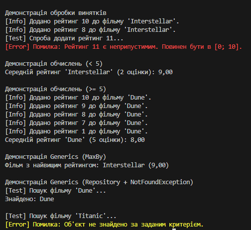

Опис задачі (Варіант 5: Рейтинги фільмів)

Цей консольний застосунок моделює систему рейтингування фільмів

Основні реалізовані вимоги:

Моделювання: Створено сутності Movie та Rating, пов'язані за принципом агрегації.

Generics:

Реалізовано узагальнений Repository<T> для зберігання сутностей.

Реалізовано узагальнений метод-розширення MaxBy<T> для пошуку елемента з максимальним значенням.

Винятки:

Створено власний виняток InvalidRatingException, який виникає при спробі додати рейтинг поза діапазоном [0; 10].

Використовується NotFoundException у репозиторії.

Робота з колекціями: Реалізовано логіку обчислення середнього рейтингу фільму. Якщо оцінок 5 або більше, одна мінімальна та одна максимальна оцінки відкидаються.

Демонстрація: Program.cs містить демонстрацію створення об'єктів, виклику методів та обробку винятків у блоках try-catch.

